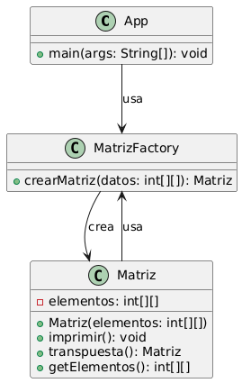

# 📐 Proyecto Matriz en Java

Este proyecto implementa una clase `Matriz` en Java que permite representar, imprimir y transponer matrices de enteros. El proyecto sigue los principios de diseño **SOLID** y utiliza el patrón de diseño **Factory Method** para la creación de objetos.

---

## 🧠 Características

- ✅ Creación de matrices a partir de arreglos bidimensionales de enteros.
- ✅ Impresión en consola en formato legible.
- ✅ Cálculo de la matriz transpuesta.
- ✅ Uso de principios SOLID y patrón creacional.

---
## Diagrama de Clases

---

## 🛠 Estructura del Proyecto

```plaintext
SOLID_Ejercicio1/
│
├── README.md
├── pom.xml
└── src/
    ├── main/java/
    │   ├── App.java
    │   ├── Matriz.java
    │   └── MatrizFactory.java
    └── test/java/
        └── MatrizTest.java

```
---
## ✅ Pruebas Unitarias

Este proyecto incluye pruebas unitarias usando JUnit 5.

### Ejecutar pruebas
```plaintext
mvn test
```
Las pruebas cubren:

- Creación de matrices.
- Cálculo correcto de la transpuesta.
- Validación del contenido de la matriz resultante.

---

## 🧪 Ejemplo de uso

```java
Matriz m = MatrizFactory.crearMatriz(new int[][]{{1, 2}, {3, 4}});
m.imprimir();
// Output:
// 1 2
// 3 4

Matriz mTranspuesta = m.transpuesta();
mTranspuesta.imprimir();
// Output:
// 1 3
// 2 4